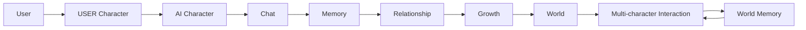
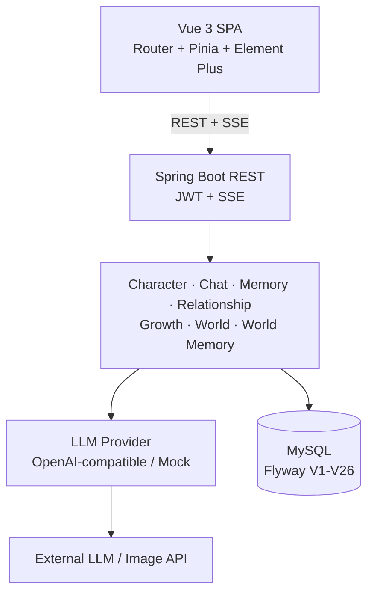
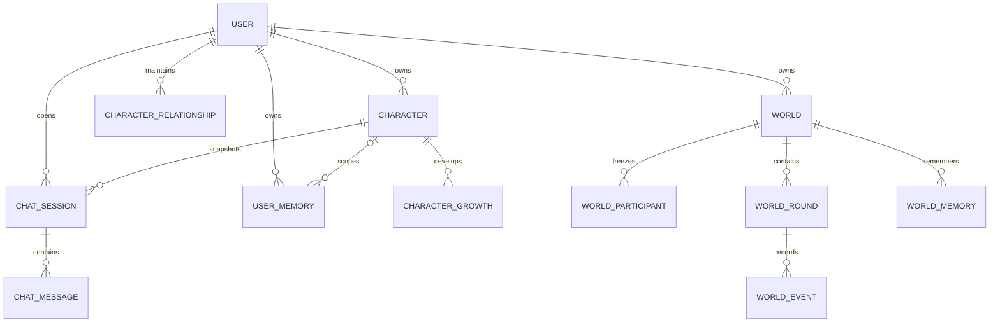

[中文](README.md) | [English](README_EN.md)

# AI Character World

**围绕持久化 AI Character 构建的角色互动平台。**

AI Character World 通过长期记忆、关系状态、成长机制与持久化 World，让 AI Character 在不同会话和多角色场景中保持连续性。项目重点不只是调用 Chat Completions API，而是围绕 AI 交互处理身份快照、状态演进、并发一致性、失败隔离与中断恢复。

**技术栈：** Java 17 · Spring Boot 3.2 · MyBatis-Plus · Flyway · MySQL · Vue 3 · Pinia · Vite · OpenAI-compatible LLM API

## 项目简介

普通 Chatbot 通常以当前对话为边界；本项目将对话放入长期存在的角色系统中。Character Identity 被持久化，相关记忆会进入后续 Prompt，Relationship 与 Growth 可以逐步变化，完成的 World Interaction 还会沉淀为后续 Round 可复用的 World Memory。历史记录使用创建时的 Snapshot，不会随当前 Character 或 World 的编辑而漂移。

## 核心体验



## 核心功能

### Character System

- 管理用户所有的 USER / AI Character，包含身份、性格、目标、经历、说话方式、结构化档案与视觉信息。
- 将 USER Character 绑定为用户身份；AI Character 用于一对一 Chat 和 World Participant。
- 支持将自然语言描述解析为可编辑草稿，以及带显式确认步骤的 Character Image 生成。

### AI Chat

- 持久化 Session 与 Message，通过 SSE 流式返回回复。
- 使用客户端 request ID 和数据库唯一约束保证提交幂等；支持停止、重试、状态同步和服务中断后的消息恢复。
- Prompt 由冻结的 Character Snapshot、受限对话历史、Memory、Relationship 和 Growth 共同组成。

### Long-term Memory

- 回复完成后执行结构化 LLM 记忆提取，并提供规则提取回退。
- 同时支持全局用户记忆与 Character-scoped Memory；检索时只合并全局记忆和当前 AI Character 的记忆。
- 按相关性、作用域、重要度、时间和稳定次序进行有界排序。

### Relationship 与 Character Growth

- 每个 User × AI Character 保存一份 Relationship 和 Growth 状态。
- Relationship 由 LLM 根据互动质量评估，而不是按消息数量机械升级；结果会影响后续 Prompt。
- Growth 记录行为适应、用户理解和成长方向，但不会覆盖 Character 的核心身份。
- 两类状态均使用 version + CAS 更新和有限重试处理并发冲突。

### World 与 Multi-character Interaction

- 创建用户所有的 World，配置背景、规则、氛围、场景、USER Character 身份，以及 2–4 个有序 AI Participant。
- 按顺序执行 AI Participant，使后续角色可以看到同一 Round 中已成功的发言。
- 持久化 World Round 与有序 Event，支持 timeline、partial failure 和前端轮询恢复。
- Participant 在加入时冻结 Snapshot；产生互动记录后锁定阵容，避免历史身份变化。

### World Memory

- 在成功完成 Round 后提取事实、角色发展、关系、事件和未解决线索等结构化记忆。
- 按 User 和 World 隔离存储，使用稳定哈希去重，并通过乐观锁合并 keyed memory。
- 检索相关且有界的 World Memory 注入下一轮 Prompt，并使用 Round 创建时的 Frozen World Snapshot 保持历史语义。

### 可靠性与安全

- 使用 JWT、BCrypt 与持久化 Auth Session，实现无状态认证和 token revocation。
- Service 查询对 Character、Chat、Memory、World、Round 和生成图片执行 ownership 校验。
- MyBatis-Plus soft delete、LLM 启动配置校验、独立 AI usage 记录，以及图片路径/下载安全检查。

## 系统架构



后端是 modular monolith，统一负责认证、业务编排、状态持久化和外部 AI 集成。当前实现不包含微服务、消息队列、向量数据库或 Agent runtime。

## 工程亮点

1. **Frozen Character Snapshot：** Chat Session 和 World Participant 保存版本化 JSON，使历史身份、图片和性格不受源 Character 后续修改或删除影响。
2. **Character-scoped Memory：** `user_id + optional character_id` 明确记忆边界，避免不同 AI Character 之间串线。
3. **Relationship CAS：** 质化关系状态持久化后参与 Prompt；version 条件更新避免并发写覆盖。
4. **Identity-safe Growth：** Growth 作为额外适应层存在，不修改冻结的核心 Character Identity。
5. **Round / Event persistence：** Round 与首个用户 Event 原子创建，LLM 调用之外逐条持久化 AI Event，可重建 timeline 并保留部分成功结果。
6. **Frozen World Snapshot：** 每个 Round 保存创建时的 World 语义，后续 World 修改不会重写历史上下文。
7. **Persistent World Memory：** 完成的 Round 被提取为 typed memory，通过 hash 去重、keyed consolidation 和相关性检索延续到下一轮。
8. **Lease + fencing recovery：** 过期 `RUNNING` Round 可被重新 claim；递增 `execution_version` 阻止旧 worker 在失去执行权后继续写入。
9. **Failure isolation：** Chat 回复完成后，Memory、Relationship、Growth 分别执行并独立捕获失败；World Memory 提取失败也不回滚已完成 Round。
10. **短事务边界：** 外部 LLM 调用不处于长数据库事务或锁中；World lifecycle 使用独立短事务。
11. **Ownership security：** 核心资源均按认证用户查询，配合 JWT、唯一约束、soft delete 与迁移级索引形成数据边界。

## 技术栈

| 范围 | 已验证技术 |
| --- | --- |
| Backend | Java 17, Spring Boot 3.2.5, Spring MVC, Security, Validation, Reactor Core |
| Persistence | MyBatis-Plus 3.5.5, Flyway, MySQL Connector/J, HikariCP |
| AI | OpenAI-compatible / Mock provider, SSE, structured JSON, prompt templates, OkHttp 4.12 |
| Frontend | Vue 3.4, Vue Router 4.3, Pinia 2.1, Element Plus 2.6, Axios 1.6, Vite 5.2, Sass |
| Testing | JUnit 5, Spring Boot Test, Mockito, H2, Node.js test runner |

仓库保留 Spring Data Redis 依赖及相关类，但 Redis 默认关闭且不是当前本地运行的硬依赖。

## 数据模型



Flyway `V1`–`V26` 覆盖基础模型、soft delete、消息生命周期、Character、World、执行恢复、Character-scoped Memory、Relationship、Growth、World Memory 和 Frozen World Snapshot。

## 项目结构

```text
ai-character-world/
├── backend/   # Spring Boot API、domain、security、Flyway、tests
├── frontend/  # Vue views、Pinia stores、API clients、tests
├── scripts/   # image acceptance helpers
├── README.md
└── README_EN.md
```

## 快速开始

前置条件：JDK 17、Maven、兼容 Vite 5 的 Node.js/npm、MySQL，以及 OpenAI-compatible endpoint 或内置 Mock LLM。仓库未提供 Maven Wrapper 或容器化配置。

```bash
git clone https://github.com/xingnan-dev/ai-character-world.git
cd ai-character-world
```

创建 `ai_virtual_companion` 数据库。默认连接为 `127.0.0.1:3307`；其他端口请覆盖 `DB_URL`。Flyway 会在后端启动时自动迁移。

```text
DB_URL=jdbc:mysql://127.0.0.1:3307/ai_virtual_companion?useSSL=false&serverTimezone=Asia/Shanghai&allowPublicKeyRetrieval=true&useUnicode=true&characterEncoding=UTF-8
DB_USERNAME=root
DB_PASSWORD=your-password
JWT_SECRET=replace-with-at-least-32-utf8-bytes
AI_PROVIDER=openai-compatible
AI_API_URL=https://your-provider.example/v1/chat/completions
AI_API_KEY=YOUR_API_KEY
AI_MODEL_NAME=your-model-name
```

无外部 LLM 时可设置 `AI_MOCK_ENABLED=true`。Character Image API 是可选集成，仅在调用相关功能时需要 `ZHIPU_IMAGE_API_KEY`。

```bash
cd backend
mvn spring-boot:run
# Backend: http://localhost:8080
```

```bash
cd frontend
npm ci
npm run dev
# Frontend: http://localhost:5173
```

Vite 将 `/api` 和 `/generated-images` 代理到 `http://localhost:8080`。

## 测试

```bash
cd backend && mvn test
cd frontend && npm test
npm run build
```

当前 `develop` 基线实测结果：

- Backend：425 tests，0 failures，0 errors，1 skipped。
- Frontend：183 / 183 passed。
- Frontend production build：PASS（存在非阻断 Sass legacy API 和 bundle-size warnings）。

## 技术说明

仓库仍保留少量历史 Three.js / VRM 兼容代码和两个 VRM 资源，但现阶段产品方向以 Character Image 与 UI 交互为主，3D 并非核心体验。

## 后续规划

以下内容尚未实现，仅作为规划：

- 最小 Agent Loop：Goal、State、Tool Calling、Checkpoint 与 Resume
- World Image Generation
- UI/UX 优化与项目截图
- 容器化、部署加固、文档与端到端回归完善
