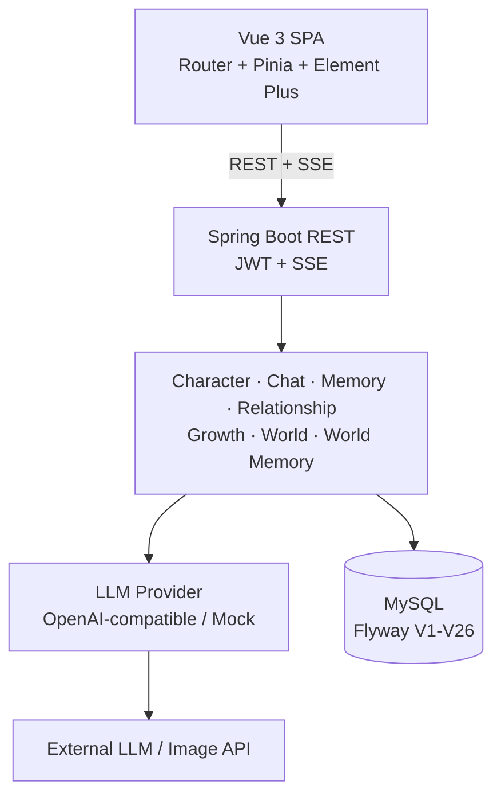
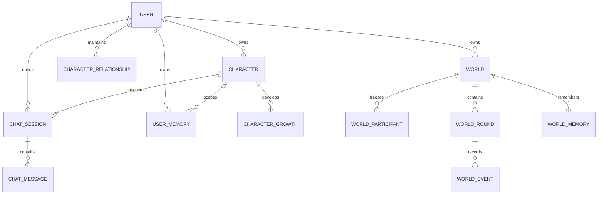

[中文](README.md) | [English](README_EN.md)

# AI Character World

**A stateful interaction platform built around persistent AI characters.**

AI Character World combines long-term memory, relationship state, adaptive growth, and persistent worlds so characters retain continuity across conversations and multi-character scenarios. The engineering focus extends beyond a chat-completions call to identity snapshots, state evolution, concurrency control, failure isolation, and interrupted-execution recovery.

**Stack:** Java 17 · Spring Boot 3.2 · MyBatis-Plus · Flyway · MySQL · Vue 3 · Pinia · Vite · OpenAI-compatible LLM API

## Overview

Most chatbots treat the current conversation as the product boundary. This project places chat inside a persistent character system: identity is stored, relevant memory returns to later prompts, relationship and growth state can evolve, and completed world interactions become reusable context. Historical records use creation-time snapshots and do not drift when a live character or world changes.

## Core Experience


## Features

### Character System

- Manage user-owned USER and AI characters with identity, personality, goals, biography, speaking style, structured profile data, and visual metadata.
- Bind a USER character as the user's identity; use AI characters in one-to-one chat and as world participants.
- Parse natural-language descriptions into editable drafts and generate character-image candidates through an explicit confirmation flow.

### AI Chat

- Persist sessions and messages while streaming assistant output over SSE.
- Use client request IDs and database uniqueness for idempotency; support stop, retry, synchronization, and recovery of interrupted message lifecycles.
- Compose prompts from frozen character identity, bounded history, memory, relationship state, and growth context.

### Long-term Memory

- Run structured LLM extraction after completed responses with a rule-based fallback.
- Store global user memory and character-scoped memory; retrieval combines only global and current-character records.
- Rank a bounded candidate set by relevance, scope, importance, recency, and stable tie-breakers.

### Relationship and Character Growth

- Keep one relationship and one growth record per user-character pair.
- Evaluate qualitative relationship changes instead of promoting stages from a message counter, then feed the state into later prompts.
- Model growth as a supplemental adaptation layer that cannot overwrite frozen core identity.
- Persist both domains with versioned CAS updates and bounded conflict retries.

### World and Multi-character Interaction

- Create user-owned worlds with semantic fields, a USER character identity, and an ordered roster of two to four AI participants.
- Execute participants sequentially so later actors can observe earlier successful speeches in the same round.
- Persist rounds and ordered events with timeline, partial-failure, and frontend polling recovery support.
- Freeze participant snapshots and lock roster replacement once interaction history exists.

### World Memory

- Extract structured facts, character developments, relationships, events, and unresolved threads after a successful round.
- Scope records by user and world, deduplicate with stable hashes, and consolidate keyed memory through optimistic updates.
- Retrieve bounded relevant memory for the next round and use the round's frozen world snapshot to preserve historical meaning.

### Reliability and Security

- Use JWT, BCrypt, and persisted auth sessions for stateless authentication and token revocation.
- Enforce ownership for characters, chats, memories, worlds, rounds, and generated images.
- Apply MyBatis-Plus soft deletion, startup LLM validation, separate AI usage records, and generated-image path/download safeguards.

## Architecture



The backend is a modular monolith that owns authentication, orchestration, domain persistence, and external AI integration. The current implementation has no microservices, message broker, vector database, or agent runtime.

## Engineering Highlights

1. **Frozen character snapshots:** Versioned JSON on chat sessions and world participants keeps historical identity, images, and personality stable after source changes or deletion.
2. **Character-scoped memory:** `user_id + optional character_id` defines explicit context boundaries and prevents cross-character leakage.
3. **Relationship CAS:** Qualitative relationship state influences prompts; conditional version updates prevent concurrent overwrite.
4. **Identity-safe growth:** Adaptation remains separate from the frozen core character identity.
5. **Round and event persistence:** The round and user event are created atomically; AI events are stored individually outside LLM calls, preserving timelines and partial successes.
6. **Frozen world snapshots:** Each round captures its creation-time world semantics so later edits cannot rewrite history.
7. **Persistent world memory:** Typed records use hash deduplication, keyed consolidation, and relevance retrieval for future rounds.
8. **Lease and fencing recovery:** Expired running rounds can be reclaimed; incrementing `execution_version` prevents stale workers from writing.
9. **Failure isolation:** Memory, relationship, growth, and world-memory side effects cannot invalidate an already completed response or round.
10. **Short transaction boundaries:** External LLM calls stay outside long database transactions and locks; lifecycle changes use focused transactions.
11. **Ownership security:** Authenticated ownership queries, unique constraints, soft deletion, and migration-backed indexes protect domain boundaries.

## Tech Stack

| Area | Verified technologies |
| --- | --- |
| Backend | Java 17, Spring Boot 3.2.5, Spring MVC, Security, Validation, Reactor Core |
| Persistence | MyBatis-Plus 3.5.5, Flyway, MySQL Connector/J, HikariCP |
| AI | OpenAI-compatible / Mock provider, SSE, structured JSON, prompt templates, OkHttp 4.12 |
| Frontend | Vue 3.4, Vue Router 4.3, Pinia 2.1, Element Plus 2.6, Axios 1.6, Vite 5.2, Sass |
| Testing | JUnit 5, Spring Boot Test, Mockito, H2, Node.js test runner |

Redis-related classes and a Spring Data Redis dependency remain, but Redis is disabled by default and is not required by the current local runtime path.

## Domain Model



Flyway migrations V1-V26 cover the base model, soft deletion, message lifecycle, characters, worlds, execution recovery, character-scoped memory, relationship, growth, world memory, and frozen world snapshots.

## Project Structure

```text
ai-character-world/
├── backend/   # Spring Boot API, domain, security, Flyway, tests
├── frontend/  # Vue views, Pinia stores, API clients, tests
├── scripts/   # image acceptance helpers
├── README.md
└── README_EN.md
```

## Getting Started

Prerequisites: JDK 17, Maven, Node.js/npm compatible with Vite 5, MySQL, and either an OpenAI-compatible endpoint or the built-in mock LLM. The repository includes neither Maven Wrapper nor container configuration.

```bash
git clone https://github.com/xingnan-dev/ai-character-world.git
cd ai-character-world
```

Create the `ai_virtual_companion` database. The default connection expects MySQL at `127.0.0.1:3307`; override `DB_URL` for another port. Flyway migrates the database on backend startup.

```text
DB_URL=jdbc:mysql://127.0.0.1:3307/ai_virtual_companion?useSSL=false&serverTimezone=Asia/Shanghai&allowPublicKeyRetrieval=true&useUnicode=true&characterEncoding=UTF-8
DB_USERNAME=root
DB_PASSWORD=your-password
JWT_SECRET=replace-with-at-least-32-utf8-bytes
AI_PROVIDER=openai-compatible
AI_API_URL=https://your-provider.example/v1/chat/completions
AI_API_KEY=YOUR_API_KEY
AI_MODEL_NAME=your-model-name
```

Set `AI_MOCK_ENABLED=true` to run without an external LLM. The character-image API is optional and requires `ZHIPU_IMAGE_API_KEY` only when that feature is invoked.

```bash
cd backend
mvn spring-boot:run
# Backend: http://localhost:8080
```

```bash
cd frontend
npm ci
npm run dev
# Frontend: http://localhost:5173
```

Vite proxies `/api` and `/generated-images` to `http://localhost:8080`.

## Testing

```bash
cd backend && mvn test
cd frontend && npm test
npm run build
```

Verified on the current `develop` baseline:

- Backend: 425 tests, 0 failures, 0 errors, 1 skipped.
- Frontend: 183 / 183 passed.
- Frontend production build: PASS, with non-blocking Sass legacy API and bundle-size warnings.

## Technical Notes

The repository retains a small legacy Three.js / VRM compatibility path and two VRM assets. The current product direction is centered on character images and UI interaction; 3D is not the primary experience.

## Roadmap

The following items are planned and are not implemented yet:

- Minimal Agent Loop: Goal, State, Tool Calling, Checkpoint, and Resume
- World Image Generation
- UI/UX polish and project screenshots
- Containerization, deployment hardening, documentation, and end-to-end regression improvements
